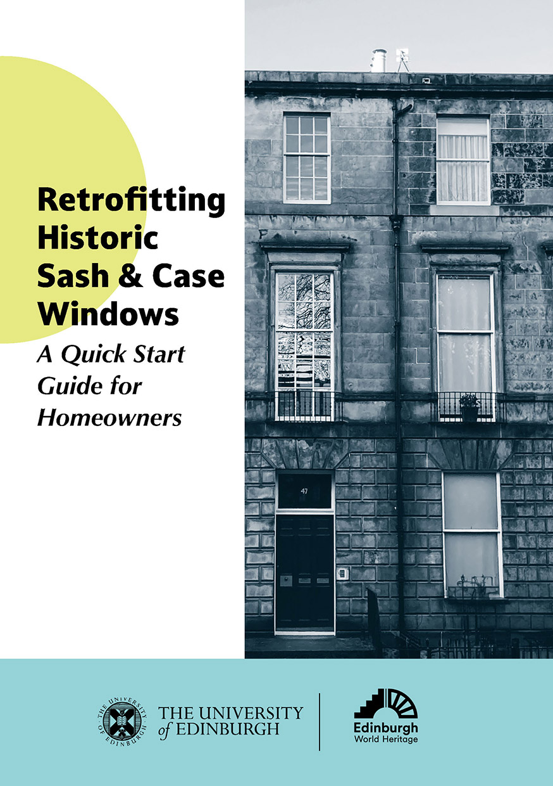

Resources on this site focus on window improvements for listed buildings and properties in conservation areas in Edinburgh. But much information is also relevant to other councils in Scotland and other types of retrofits.

==Materials on this site supplement the information provided in **_Retrofitting Historic Sash & Case Windows: A Quick Start Guide for Homeowners_**.== Download the PDF by clicking on the image below. You can also request a printed copy to be posted to you by filling out [this form](). 

<figure class="my-6 mx-auto text-center w-7/12 md:w-2/5 lg:w-1/3">
  
  <figcaption class="mt-2 text-xs italic text-gray-600 dark:text-gray-400">
    Click the image to download from Edinburgh Research Archive.
  </figcaption>
</figure>

> [!NOTE] Disclaimer!
> Every property is different! The materials on this site are for general information only and is not a substitute for professional advice or surveys.   