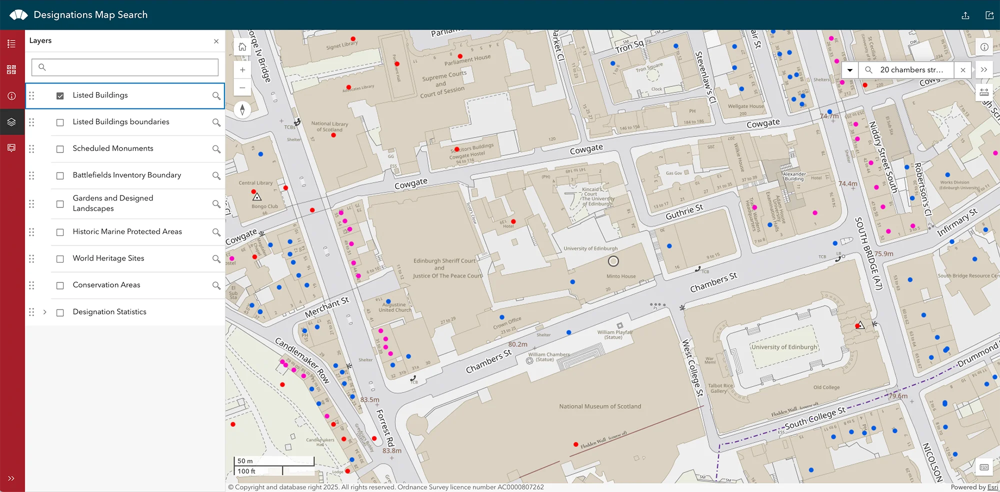
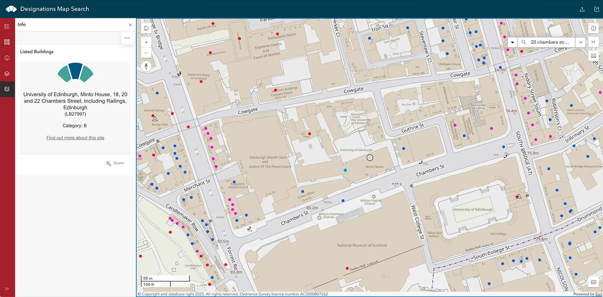
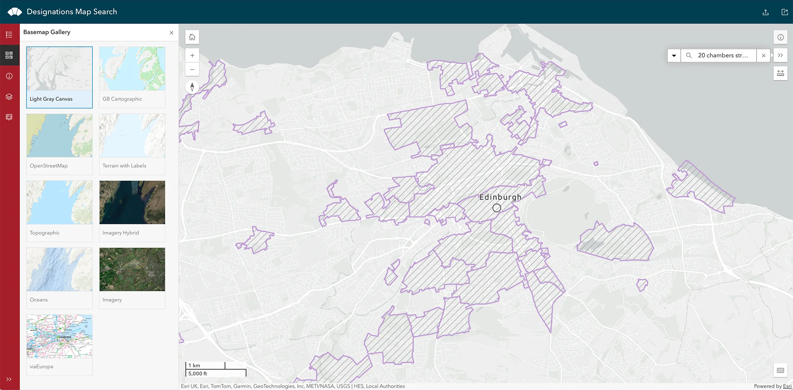
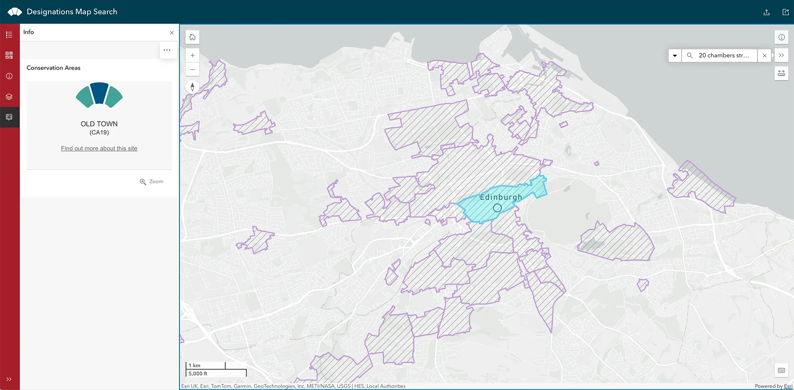
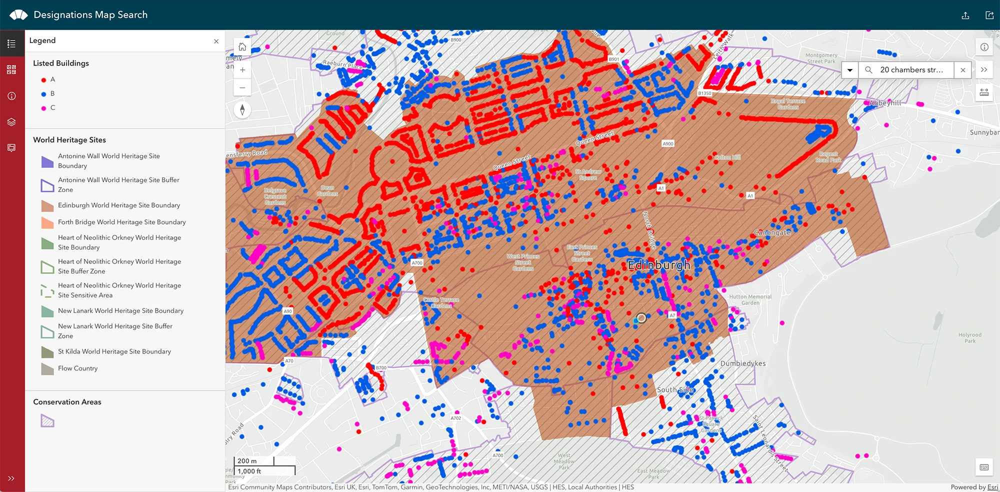

Chances are if your home is a **listed building** you would have known this when you purchased it. However, you may not know if your home is located in a **conservation area** (or the Edinburgh World Heritage Site). Both the Historic Environment Scotland (HES) and the City of Edinburgh Council (CEC) provide websites for you to check.

- City of Edinburgh Council [map](https://cityofedinburgh.maps.arcgis.com/apps/instant/nearby/index.html?appid=1aa327bfdb5f4559b0ea4f82265b438f&sliderDistance=250&hiddenLayers=Planning_3941%3BPlanning_9741)
- Historic Environment Scotland (HES) [search portal and map](https://www.historicenvironment.scot/advice-and-support/listing-scheduling-and-designations/listed-buildings/search-for-a-listed-building/). The site is for listed buildings, but the [map](https://hesportal.maps.arcgis.com/apps/instant/sidebar/index.html?appid=2059ed04c56b402e8b5197c661bec594) can be used to locate conservation areas.

> [!Note]Note
> You would want to know the protected status of your property, because whether it is a **listed building** or an _unlisted_ building located in a **conservation area** (or World Heritage Site) will influence the restrictions you have and the references you need to consult.

### Tips on navigating the HES map[^1]
#### **1. Use the 'layer' function to make the map more readable:** 

After typing in your address (including postcode) in the search field and press enter, the map will zoom in. This is when you will notice that there are too many colours and symbols. To make the maps more readable, you want to **turn off some layers**. On the left hand side (in the red band) there are several icons that represent different functions. The second to the last one is **Layers**. Click on that and uncheck all layers except **_Listed Buildings_**. 

In the below example, the listed building searched is the Edinburgh School of Architecture and Landscape Architecture (Minto House), located at 20 Chambers Street EH1 1JZ. 

<figure class="my-6 mx-auto text-center">
  
  <figcaption class="mt-2 text-xs italic text-gray-600 dark:text-gray-400">
    Screenshot of the HES map search result showing all layers turned off except 'Listed Buildings'.
  </figcaption>
</figure>

#### **2. Click on the coloured dots to get more info:** 

If your property is a **Listed Building**, there will be a **coloured dot** shown on the map at the location. The colour indicates the listing category (red is A, blue is B, pink is C). **Click on the dot** and further info will appear on the left-hand side panel, with link to HES page about this particular building, including _Statement of Special Interests_ and bibliography.

In the example below, clicking on the blue dot on the map summons the info panel, indicating the correct address of Minto House and providing an external link to learn more about this Category B listed building.

<figure class="my-6 mx-auto text-center">
  
  <figcaption class="mt-2 text-xs italic text-gray-600 dark:text-gray-400">
    Screenshot of the HES map search result showing the Listed Building info panel.
  </figcaption>
</figure>

#### **3. Choose a different basemap to see the Conservation Areas:** 

If you want to check whether the building is located in a conservation area, first **zoom out** a little, then **turn on the _Conservation Areas_ layer**. You may also wish to turn _off_ the Listed Building layer so the map is not overwhelmed with dots. At this point you will also notice that the default basemap (with streets and other features) will make the map difficult to read. Therefore, it's better to **select a more subdued basemap** so the conservation area boundaries will show up better. 

In the below example, _Light Gray Canvas_ is selected. _Topographic_ is another suitable choice. 

<figure class="my-6 mx-auto text-center">
  
  <figcaption class="mt-2 text-xs italic text-gray-600 dark:text-gray-400">
    Screenshot of the HES map search result with Conservation Area and a lighter basemap.
  </figcaption>
</figure>

#### **4. Click on the region to see the Conservation Area name:** 

Clicking on the region containing your search result (the address you looked up) will select the conservation area. And an information panel will again appear on the left-hand side, tellling you the name of the conservation area and a link to the council website. 

In the below example, Minto House is shown to be in the Old Town Conservation Area. 

<figure class="my-6 mx-auto text-center">
  
  <figcaption class="mt-2 text-xs italic text-gray-600 dark:text-gray-400">
    Screenshot of the HES map search result with Old Town Conservation Area selected.
  </figcaption>
</figure>

#### **5. Use legend to help identify other features:** 

You can explore other features (layers) of the HES map, such as the World Heritage Sites. Use the legend to better identify what the map shows. 

In the below example, the layers for **_Listed Buildings_**, **_Conservation Areas_**, and **_World Heritage Sites_** are all turned on. We can now see that Minto House is also situated within the Edinburgh World Heritage Site Boundary. 

<figure class="my-6 mx-auto text-center">
  
  <figcaption class="mt-2 text-xs italic text-gray-600 dark:text-gray-400">
    Screenshot of the HES map search result with Listed Building, Conservation Areas, and World Heritage Sites layers turned on.
  </figcaption>
</figure>

[^1]: All screenshots taken from the Historic Environment Scotland's [_Designations Map Search_](https://hesportal.maps.arcgis.com/apps/instant/sidebar/index.html?appid=2059ed04c56b402e8b5197c661bec594) portal. All rights reserved by Ordnance Survey and Improvement and Development Agency for Local Government. 