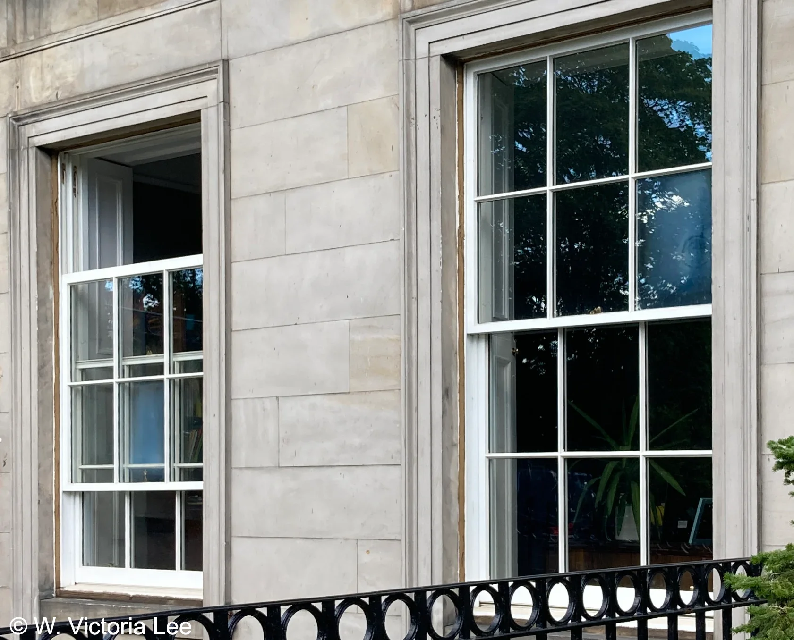
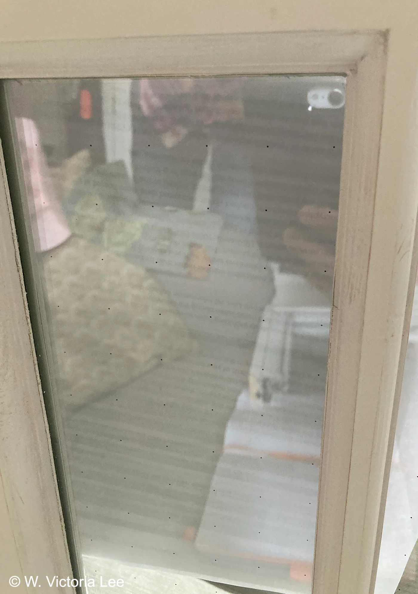
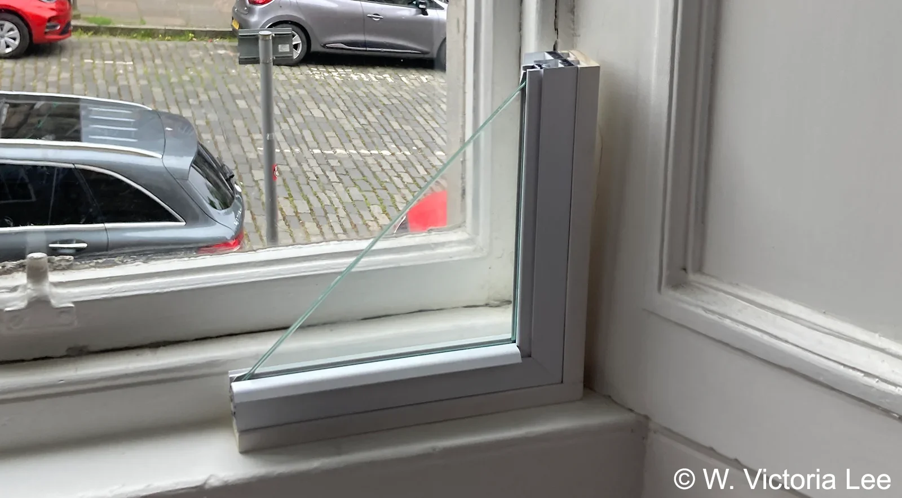
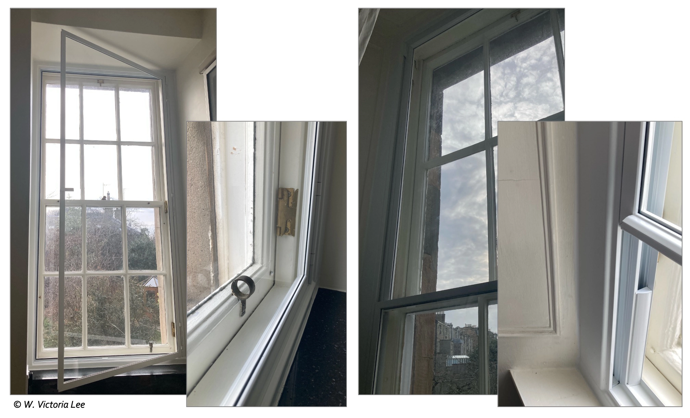
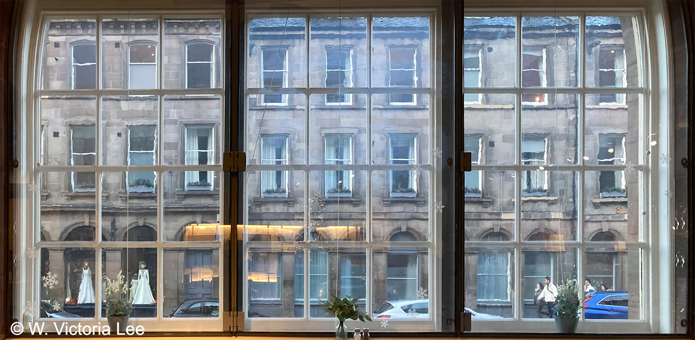
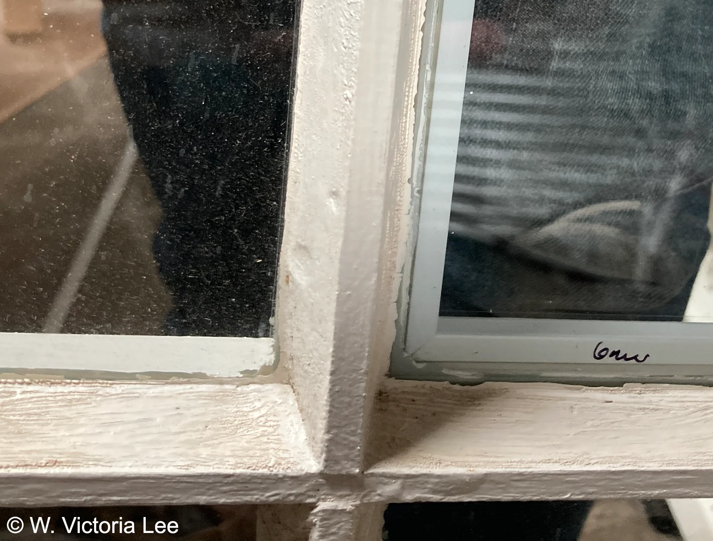

==**_[Retrofitting Historic Sash & Case Windows: A Quick Start Guide for Homeowners]()_** discusses the different improvement options.== This page provides some additional information and examples of the different options. To avoid endorsing any particular product, no brand names are mentioned. The purpose of this page is to show you the range of possibilities out there.  

### Draughtproofing & Refurbishment
As explained in [Common Window Issues](), you can lose heat through the window in two ways: through the glass panes themselves or through the air leakage around the frames and any moveable parts. If you have excessive air leakage, you can have triple-glazing and still be cold. Therefore, before you decide to improve the glazing, draughtproofing should be considered first. 

Draughtproofing here refers to professional, joinery‑based work on timber-framed windows, typically done as part of a refurbishment to service any rotted parts and peeling paint. This is very different from DIY stick‑on foam, which is short‑lived and can damage the window. Professional draughtproofing usually requires the complete removal of the window to make any necessary repairs and to service the cords, pulleys, and weights. Brush-piles are then inserted into the frames or the parting beads/baton rods to fill the gaps and create a seal. 

Although brush-piles are less air-tight than the rubber seals typically seen on modern windows, they are more customisable to fit historic windows which may not have uniform gaps all around. Further, as explained in [Basic Principles](), historic and traditional buildings are not designed to be airtight. For instance, some air movement is meant to pass through even a good condition sash and case window.

> [!Note] Note
> Generally, if you are just draughtproofing and refurbishing your window without upgrading the glazing, there is likely no planning paperwork required as the work is maintenance/repair and won't affect the character of the building. 

### Double-Glazing
Double-glazing is called ‘Insulated Glass Units’ or IGUs in the technical parlance. This means two panes of glass separated by a gap filled with air or inert gas. This construction can reduce the heat loss through the glass panes themselves (see [Common Window Issues]()). The depth of the gap between the two glass panes, the type of gas that fills this gap (or if the gap is a vacuum cavity), and indeed the thickness and type of glass panes themselves, can all influence how much heat goes through the glass. 

The most common construction for double-glazing uses two glass panes each 4-6mm in thickness, with a gap about 13-20mm between them. The entire double-glazed pane typically has a profile thickness of 20-25mm. If the gap between the two glass panes is a [vacuum cavity](#vacuum-glazing), then the gap only needs to be 0.2mm, bringing the total profile thickness to as low as 8.2mm.

> [!Note] Note
> Double-glazing refers only to the glass part of the window. It does NOT automatically mean the window must have a uPVC (or any othe material) frame. Although the most typical double-glazing on the market today are associated with uPVC frame (because they are cheap to produce), it is possible to have double-glazing in frames made from other materials, such as timber.

#### Slim-Profile
The profile depth of window pane can have important implications to the appearance of the overall window. To preserve the look of the historic windows, typically the profile needs to be quite slender – thinner than the typical double-glazing construction with air or gas-filled gaps. This means that the typical double-glazing panes cannot be installed in most historic windows. This is where a special kind of double-glazing, aptly named ‘slim-profile’ or ‘narrow-profile’, comes in. These double-glazing panes have gaps of only 3-6mm in depth. The fact that the gap between the two panes of glass is much shallower does compromise the double-glazing’s ability to reduce heat loss through the glass.

There is also some concerns about the longevity of the panes as the edge seals around the gap can fail and allow the filled gas to escape. When this happens, the glass pane is said to have been ‘blown’. Fog and condensation can form inside a blown double-glazing pane, blurring the view and reducing the thermal performance of the window (see image below). The blown pane can be repaired but this would be costly and not a permanent fix. Often the best remedy for a blown pane is a complete replacement.

<figure class="my-6 mx-auto text-center w-3/4 md:w-1/2">
    
  <figcaption class="mt-2 text-xs italic text-gray-600 dark:text-gray-400">
    Example of blown panes on slim-profile double glazing windows.
  </figcaption>
</figure>

It’s difficult to say how much more likely or under what circumstances blown panes happen in slim-profile double-glazing, because workmanship and skills of the joiners and glaziers are also factors, just like anything that’s assembled by humans. If the existing timber on the sashes is already fragile, it may not be possible to route them to accept the thicker double-glazing. (The slim-profile glazing, although thinner than regular double glazing, is still thicker than single-glazing).

Currently, most slim-profile double-glazing (sometimes called ‘low-sightline’) products[^1] are not deemed as legally compliant with the Construction Products Regulations (CPR), which required the double-glazing to be manufactured in accordance with the European Standard EN 12795. You can read the statement from the [Glass and Glazing Federation (GGF)](https://edin.ac/4p0WPHl).

#### Vacuum Glazing
An alternative to slim-profile double glazing is vacuum cavity double-glazing, which naturally has a very narrow profile due to the 0.2mm gap between the panes. The vacuum cavity provides excellent insulation and can reduce heat loss through the glass panes even better than the standard double-glazing with 13-20 mm gap filled with inert gas. However, the current market is such that vacuum cavity double-glazing can be quite expensive. The most popular product also comes from continental Europe meaning longer lead time to when the actual work can begin.

Because there is no air nor gas in the gap between the glass panes, vacuum glazing usually has spacers to keep the gap from collapsing on itself. These spacers show up as tiny dots on the glass panes. The dots are usualy not obvious but are visible if you know what to look or are very close to the window. An example can be seen in the image below.

<figure class="my-6 mx-auto text-center w-3/4 md:w-1/2">
    
  <figcaption class="mt-2 text-xs italic text-gray-600 dark:text-gray-400">
    Example of vacuum double glazing with spacers that appear as tiny dots.
  </figcaption>
</figure>

### Secondary Glazing
There are many different types of secondary glazing. The most involved option should probably be called secondary _window_, not secondary _glazing_, as it is essentially a whole other window with its own frame (often in aluminium or timber) that is installed behind your primary window on the interior windowsill. Depending on the configuration, often such installation will prevent the use of shutters. The photo below shows a corner sample of such a system in position for a historic sash and case window.

<figure class="my-6 mx-auto text-center w-3/4 md:w-1/2">
    
  <figcaption class="mt-2 text-xs italic text-gray-600 dark:text-gray-400">
    A corner sample of secondary glazing with metal frame.
  </figcaption>
</figure>

Similar secondary window systems with lighter frames and plastic (not glass) panels are possible and these can open in a variety of ways (e.g. open inward, slide up and down).

<figure class="my-6 mx-auto text-center">
    
  <figcaption class="mt-2 text-xs italic text-gray-600 dark:text-gray-400">
    Examples of secondary glazing system with large plastic sheets.
  </figcaption>
</figure>

Glass panels can also be attached to the primary window via methods with less substantial frames. An example via metal clasps can be seen at the National Galleries Scotland: Portrait in Edinburgh.

<figure class="my-6 mx-auto text-center">
    
  <figcaption class="mt-2 text-xs italic text-gray-600 dark:text-gray-400">
    Secondary glazing system at the National Galleries Scotland: Portrait.
  </figcaption>
</figure>

Instead of glass, some secondary glazing systems use large transparent plastic sheets that are attached via magnetic strips or velcro. In order to open your primary window, these plastic sheets often need to be removed entirely and set aside. Whilst this may cause inconvenience, the advantage is that these sheets can be easily detached and put away when they are not needed in the summer.

The most minimalist secondary glazing are tile-sized polycarbonate panels that can be friction-fitted between the primary window astragals, leaving only a few millimetre between the panels and your existing glazing. These relatively affordable panels don’t affect the way your primary window opens but may not improve the energy efficiency of your window by much. They may also make the astragals appear thicker when viewed from the outside.  

<figure class="my-6 mx-auto text-center w-3/4 md:w-1/2">
    
  <figcaption class="mt-2 text-xs italic text-gray-600 dark:text-gray-400">
    An example of how the plastic panel looks when installed (right pane).
  </figcaption>
</figure>

### Special Coating
Glass panes can have special coatings to improve their insulating quality. The most common one is low-emissivity (low-e) coatings, which can reduce the heat loss through the glass pane by reflecting back the heat in the room instead of letting that heat escape through the panes. For this reason, the coating should be on the side of the glass pane facing the interior. For double-glazing, the coating can also be facing the gap between the glass panes, depending on how the coating was applied and its composition durability.

Most commonly, low-e coating is applied during the glass production as a microscopically thin and transparent layer. Although transparent, low-e coating will reduce the amount of visible light that passes through somewhat, as well as the heat from direct sunlight. Although an added benefit is that low-e coating can also reduce the amount of ultraviolet (UV) light that gets transmitted – which can help reduce fading of furniture or flooring.

It is possible to buy low-e films to apply to existing window panes yourself (DIY). However, these films can make the glass look tinted. The films would need to be cut to the precise size of the glass pane and the applications of the film can also be fiddly to avoid bubbles.

> [!Note]Note
> Sometimes special coating can make the glazing look slightly cloudy. Be sure to ask the tradespeople to show you samples before deciding.

### Shutters
Historic windows had shutters before they had glass panes, and many historic windows still have them. Most guidance encourages you to reinstate them if you don’t currently have any and the design of your window suggests there may have been shutters in the past.  

When closed, shutters add an extra layer over the glazing, helping to cut draughts and noise and improve privacy and security at night. Some people use them instead of curtains or blinds. The trade‑off is that shutters completely block light and views, so they’re not as useful during the day. 

When not in use, shutters for historic windows usually fold into a recess in the wall on either side of the window (See p. 4 of _[Retrofitting Historic Sash & Case Windows]()_). Sometimes shutters are painted shut and may need careful releasing, which can be done as part of a refurbishment. If there’s no shutter, or the shutter is of poor condition, new shutter can be made by skilled joiner in the style of the same period as your window (which may include panelled design moulding). Whether you are refurbishing or reinstating your historic window shutters, you might want to consider how the shutters fasten, and how the shutters can be pulled out of the wall recess and manoeuvred. More can be learned about shutters from Historic Environment Scotland's [INFORM Guide](https://www.historicenvironment.scot/archives-and-research/publications/publication/?publicationId=0d28af6e-8eea-46e4-829b-a59800a6b1bb).

[^1]: These slim-profile products may also be called _slimlite_ or _slimline_. 