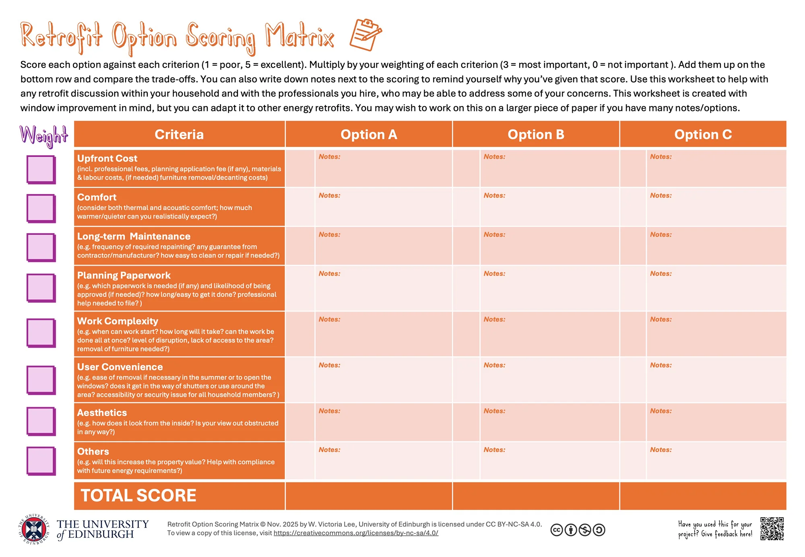

In addition to upfront cost and energy efficiency, there are several other factors to consider when considering your options of window improvements. Use the below worksheet to clarify your priorities and compare the different improvement and retrofit options. 

<figure class="my-6 mx-auto text-center">
  
  <figcaption class="mt-2 text-xs italic text-gray-600 dark:text-gray-400">
    Click the image to download from the Edinburgh Research Archive.
  </figcaption>
</figure>