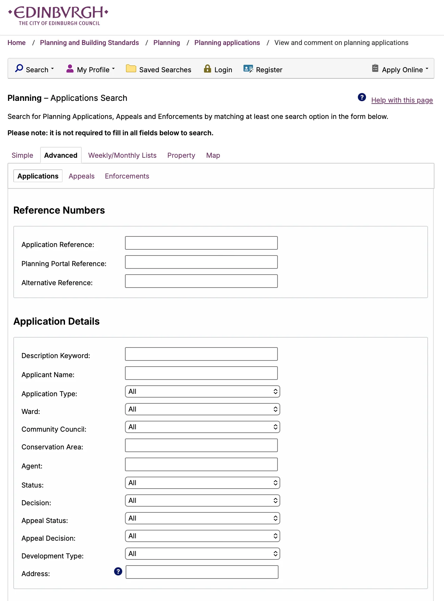
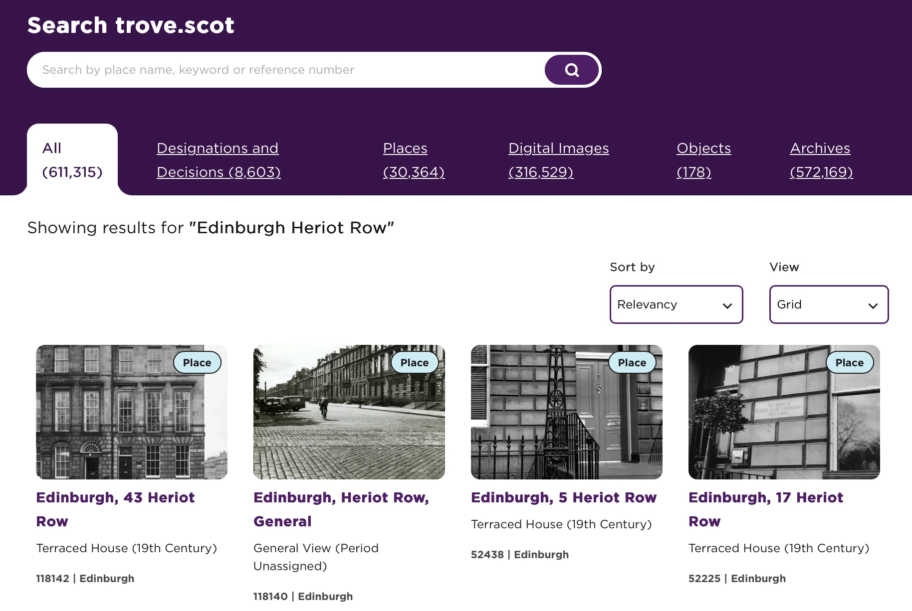

Most guidance recommend that you consult professionals (e.g. conservation architects) to deal with planning matters when doing works to historic buildings. Indeed, preparing the necessary planning paperwork (or even just to find out if you need to apply for permission) can be daunting and time-consuming. However, depending on the scale of the work you plan to do, the fee incurred by professional services can feel disproportionate to the total cost of the work.

For window improvements, some tradespeople or glazing companies may offer to do the paperwork for you for an extra fee. Still, it's understandable that many homeowners would prefer to economise as much as possible and tackle the planning paperwork on their own. Hopefully, the information on the **[Planning Paperwork]()** page provided you some pointers if you decide to manage planning matters yourself. This page offers a few more tips to help strengthen your case in planning applications. Be sure to also see the list of **[Useful Documents]()**.

### :pencil2: Use the planning portal to look at similar applications
You can get a sense of what completed applications (be that LBC, planning permission, certificate of lawfulness, or prior approval) look like by searching on the City of Edinburgh Council **[planning portal](https://citydev-portal.edinburgh.gov.uk/idoxpa-web/search.do?action=simple&searchType=Application)**. The interface allows you to search by keyword (e.g. windows, double-glazing) and address. If you click on the **Advanced** search tab, you can further search by application type, decision (granted or refused), date, among other parameters. 

<figure class="my-6 mx-auto text-center w-9/12 md:w-3/5 lg:w-2/3">
  
  <figcaption class="mt-2 text-xs italic text-gray-600 dark:text-gray-400">
    Screenshot of Edinburgh Planning Portal Advanced Search.
  </figcaption>
</figure>

Once you've located the applications of interest, you can view the completed forms (applicant contact info redacted) and associated documentations (e.g. drawings, site plans). Looking at these completed (and decided on) applications will give you a sense of the depth and scope of the information you need to provide, such as the supporting/design statement (if required) where you explain how the proposed work will not harm the character. You can also read the decision letters which can provide some insight into how these decisions are made and reasons for refusal.

### :pencil2: Focus on policy, not precedents
Because planning decisions are merit-based judgement calls, there is no 'precedent' in planning. This means that just because your neighbours were allowed to make certain alteration, or if you've seen similar alteration done elsewhere, it doesn’t guarantee that the alteration will be permitted in your specific case as well. Therefore, it does not help your cause to mention 'precedents' in your applications.

Instead, explain how your proposal meets the development plan (e.g. NPF4, Edinburgh City Plan 2030) and address any potential impact on the listed building or conservation area. You would want to reference the _Statement of Special Interests_ for the listed building, which you can obtain from the Historic Environment Scotland Designations Map Search (see [Tips on Navigating the HES Map]()). For conservation areas, you would want to reference the relevant **[Conservation Areas Character Appraisals](https://www.edinburgh.gov.uk/directory/10219/conservation-area-character-appraisals)**. 

Also don't forget the City fo Edinburgh Council's guidance for _**[Listed Buildings and Conservation Areas](https://www.edinburgh.gov.uk/downloads/file/27028/listed-building-and-conservation-areas)**_ and Historic Environment Scotland's _**[Managing Change Guidance Notes](https://www.historicenvironment.scot/archives-and-research/publications/?searchPubText=Managing+Change)**_, including the one for [windows](https://www.historicenvironment.scot/archives-and-research/publications/publication/?publicationId=3425bb51-8a55-4f99-b7aa-a60b009fbca2), all of which are material considerations for planning application decisions.

### :pencil2: Use public archives to learn more about your building
For historic buildings, most guidance would encourage that the proposed work would replicate the 'original' details of your historic building, such as windows.[^1] What the 'original' windows of the building look like can sometimes be difficult to determine and may require some historical sleuthing. 

Technically, ‘original’ means the windows that were there when the building was first built. But depending on when the building was constructed, the ‘original’ windows could have been replaced with windows of other historic eras as ownership changed hands. This means that the windows on the buildings now may not be ‘original’ but nevertheless are historically significant. One can sometimes make an educated guess by looking at the windows of neighbouring buildings from the same era. But the best way of finding out what the windows (and buildings as a whole) look like in the past is by looking at historic photographs and drawings.

Fortunately, many such historic documents had been digitised and made available to the public online. You can search for photographs or drawings of your building or street/neighbourhood by going to **[trove.scot](https://www.trove.scot/search?page_type=Archives&viewmode=grid)**. The image below shows the search result for 'Edinburgh Heriot Row'. Note that some items listed on trove.scot are only available to view in-person. For these you can visit the **[HES Archives and Library](https://www.historicenvironment.scot/visit-a-place/places/hes-archives-and-library/visiting-us/).**

<figure class="my-6 mx-auto text-center">
  
  <figcaption class="mt-2 text-xs italic text-gray-600 dark:text-gray-400">
    Screenshot of trove.scot showing search results of 'Edinburgh Heriot Row'.
  </figcaption>
</figure>

[^1]: Sometimes the word 'existing' is used instead of 'original'. This can be a source of confusion. For instance, if a previous owner of your property has changed the windows to a modern (and inappropriate) type of window, that window would technically be 'existing' (to you) but would not be what the reviewers of the planning applications be looking for.