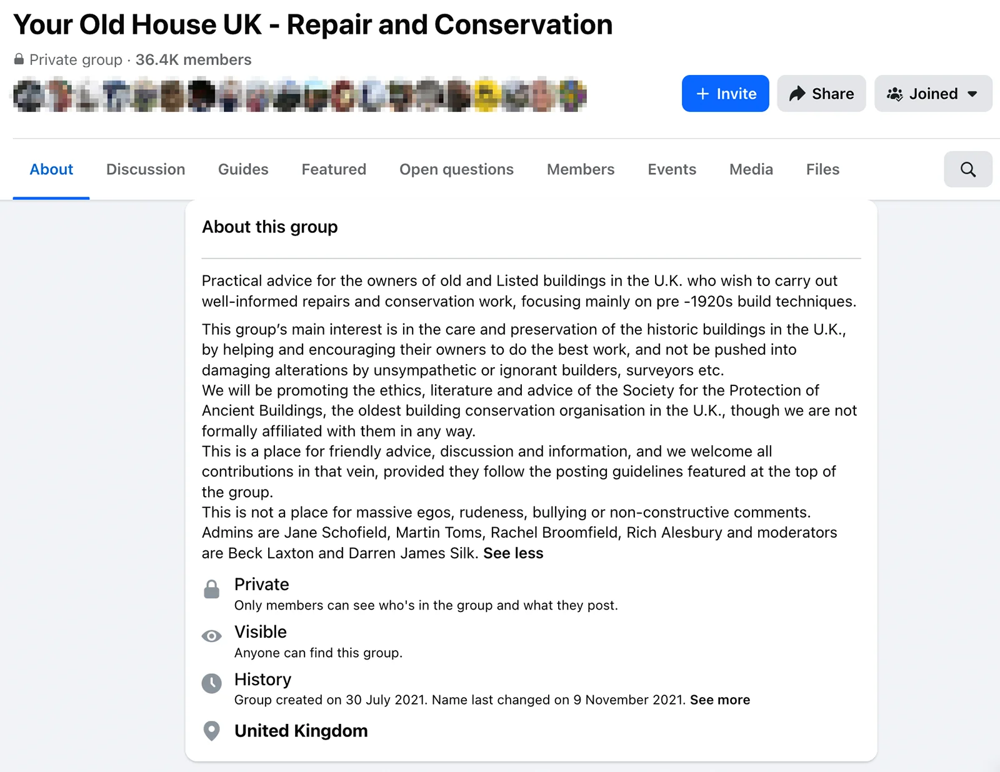

There is an abundance of information on the web regarding energy efficiency improvements and retrofits, some of which are even historic buildings specific. However, often the information is provided by companies or professionals whose advice might be sales-driven. 

In addition to the resources in [Useful Documents](), the below list provides further neutral sources from government agencies, public bodies, and charities; as well as books and further reading that you might find useful.
***
### :phone: Independent Free Advice
Below are resources where you can receive one-on-one engagement with humans (by phone or email). 

- **[SPAB (Society for the Protection of Ancient Buildings) Technical Advice phone Line](https://www.spab.org.uk/advice):** UK-wide charity with technical advisors with whom you can speak with to ask technical questions regarding maintaining and repairing your historic property. You don't need to be a member to use this service. At the link you can also search their Knowledge Base for articles. 
- **[Under One Roof - Ask an Expert](https://underoneroof.scot/ask-an-expert/):** Under One Roof is a Scottish charity specialising in helping tenement flat owners. They provide impartial advice on both logistical (such as common repairs) and technical (such as retrofits) matters. The link takes you to their e-mail based advice service. It should be noted that Under One Roof is also recommended by Citizens Advice Scotland.
- **[Home Energy Scotland](https://www.homeenergyscotland.org/contact-us):** Home Energy Scotland is funded by the Scottish Government and provides energy advice for all households in Scotland by phone, email, and WhatsApp. Note that the organisation's remit covers all households, so the information provided might not always be applicable to historic properties. 
- **[Changeworks - Green Energy Helpline](https://www.changeworks.org.uk/greenenergy/):** Changeworks is a Scottish charity working to decarbonise Scotland's homes. Their remit covers _all_ homes, so you should be aware that information provided by them might not always be applicable to historic properties.

***

### :computer: Websites
Below are articles and online documents and tools from trustworthy sources. 

- **[The Engine Shed - Building Advice](https://www.engineshed.scot/building-advice/):** The Engine Shed is Historic Environment Scotland’s dedicated building conservation centre. Their website provides information that is specific to historic properties, including different building elements, materials, maintenance, and energy efficiency. In addition to technical information, the website also has a section on **[Hiring a Contractor](https://www.engineshed.scot/building-advice/common-problems/hiring-a-contractor/)**. 
- **[Historic Environment Scotland Publications](https://www.historicenvironment.scot/archives-and-research/publications/?):** You can search Historic Environment Scotland's publication catalogue online. Using the filter on the left-hand side and the search field you can easily locate documents relevant to specific building elements, such as [windows](https://www.historicenvironment.scot/archives-and-research/publications/?searchPubText=window).
- **[SPAB (Society for the Protection of Ancient Buildings) Knowledgebase](https://www.spab.org.uk/advice):** You can search SPAB's Knowledgebase for a variety of articles (from planning to materials to energy efficiency). Do note that because SPAB is a UK-wide organisation, the planning information will be at higher level and may not always apply to Scotland (planning is a devolved matter). 
- **[Under One Roof](https://underoneroof.scot/retrofit/):** Under One Roof's website also includes many retrofit articles, many targeted at historic properties, including a [link to the _Retrofitting Historic Sash & Case Windows_](https://underoneroof.scot/guide-for-retrofitting-historic-sash-and-case-windows/).
- **[Home Energy Scotland - How to Make Your Home Warmer](https://www.homeenergyscotland.org/make-home-warmer):** Home Energy Scotland's website has a wealth of information. Towards the bottom of this page there are articles on specific building parts, one of which is on [windows and doors](https://energysavingtrust.org.uk/advice/windows-and-doors/)(links to Energy Saving Trust, a UK-wide organisation). Again, as Home Energy Scotland's remit covers all homes, information on their website is not tailored to historic properties but can still be useful. 
- **[Home Energy Scotland - Home Energy Check](https://homeenergyscotland-advice.est.org.uk/HEC/):** Home Energy Scotland has a self-guided tool that can generate some specific improvement recommendations based on your home's characteristics (which are based on what you provide in the interface and assumptions made based on your address). But again, these recommendations would not be tailored for historic properties. 
- **[Changeworks](https://www.changeworks.org.uk/):** Changeworks' website has much information on energy improvement and retrofit measures. They also offer a paid-for retrofit management service. Again, as Changeworks' remit covers all homes, information on their website is not tailored to historic properties but can be useful nonetheless.

***

### :books: Books
This section contains detailed reference manuals that are usually intended for tradespeople and conservation professionals. However, you may wish to consult them to learn more about your historic property and/or checking on what the tradespeople have told you. 

These manuals are usually available only in hard copies. Wherever available, I've included link to the Edinburgh Libraries Catalogue where you can check them out yourself.

- :blue_book: **The Care and Conservation of Georgian Houses: A Maintenance Manual for Edinburgh New Town:** By Andy Davey and others; published by Butterworth-Architecture. The latest edition of this manual is the 4th edition (1995). The [Edinburgh Library](https://edin.ac/4oomokW) has the 3rd edition (1986). The book is no longer in print! But many (professional/heritage and DIY enthusiasts) found this to be very helpful and you may be able to find a used copy online. 

- :blue_book: **Conservation of Timber Sash and Case Windows: Maintaining, Repairing and Improving the Performance of Traditional Windows:** By Stephen Newsom; published by Historic Scotland (2002). Free PDF can be downloaded from the [Historic Environment Scotland website](https://www.historicenvironment.scot/archives-and-research/publications/publication/?publicationId=ae41ad09-7905-42d3-a8dc-a5ad00a3cf26). You can also purchase a hard copy for £6.

- :blue_book: **The Historical and Technical Development of the Sash and Case Window in Scotland:** By Nessa Roche; published by Historic Scotland (2001). Hard copy available from the [Edinburgh Library](https://edin.ac/3XWD2gs)

***

### :speech_balloon: Online Forums
Below are two Facebook Groups for owners of historic buildings to share tips, experiences, and questions about maintenance, repair and retrofit. Posts reflect members’ own opinions and may be inaccurate or irrelevant based on your region. :exclamation: Please exercise discretion when reading these posts. Both are private groups. Therefore, you must already have a Facebook account in order to see the below links.

- **[Your Old House UK - Repair and Conservation](https://www.facebook.com/groups/youroldhouseuk/about):** A UK-wide Facebook Group for owners to share practical advice on caring for historic properties. The below image shows the screenshot of the _About_ page  so you can have a better idea of the size and remit of the group.
<figure class="my-6 mx-auto text-center">
  
  <figcaption class="mt-2 text-xs italic text-gray-600 dark:text-gray-400">
    Screenshot of the About page of the Facebook Group 'Your Old House UK'
  </figcaption>
</figure>

- **[Traditional and Listed Building Advice](https://www.facebook.com/groups/143020647730378/):** This group doesn't have an about page or explicit geographic remit. But most posts are from the UK and currently has ~38K+ members.
